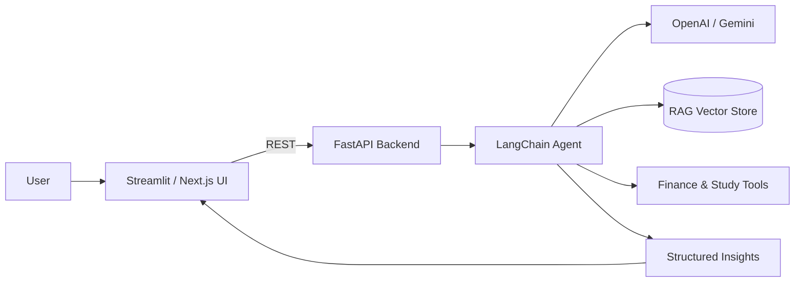

<!--
  ══════════════════════════════════════════════════════════════════
  Adityaraj Patil · GitHub Profile README · v4 "Frost Pro" edition
  Structure inspired by pro dev profiles · white/silver glassmorphism
  · every custom asset animates (typewriter banner, tech marquee,
    comet dividers, wave footer) · theme-adaptive stats & cards
  Placeholders (marked TODO): 1. LeetCode username check  2. Email
  ══════════════════════════════════════════════════════════════════
-->

  

  
  &nbsp;
  
  &nbsp;
  
  &nbsp;
  <!-- TODO-leetcode: uncomment the badge + section below once you confirm your LeetCode username,
       then replace ALL "ap1807" occurrences in the LeetCode card URLs with it.
  
  -->
  &nbsp;
  <!-- TODO-email: replace with your real email address -->
  

  
  &nbsp;
  
  &nbsp;
  
  &nbsp;
  

### ⚡ Developer Overview

<table width="100%">
<tr>
<td width="50%" valign="top">

#### 👤 Profile
- 💻 **Role** — AI/ML Engineer · CSE @ LPU
- 📍 **Location** — Phagwara, Punjab, India
- 🎯 **Focus** — LLM agents · RAG pipelines · applied ML
- 🚀 **Status** — Open to internships & collaborations

</td>
<td width="50%" valign="top">

#### 💡 Core Stack
- 🎨 **Frontend** — Next.js, React, TypeScript, Streamlit, Tailwind
- ⚙️ **Backend** — Python, FastAPI, Django, PostgreSQL
- 🤖 **AI / ML** — LangChain, OpenAI, Gemini, PyTorch, RAG
- ☁️ **DevOps** — Docker, Git, Vercel, AWS

</td>
</tr>
</table>

> 💬 *"Take AI projects past the demo stage — clean architecture, measurable output, and a UI people actually want to use."*

### 🛠️ Tech Stack & Skills

<!-- counter-scrolling frosted marquee — the stack in motion -->

  <b>〈 LANGUAGES & FRONTEND 〉</b> 
  

 

  <b>〈 BACKEND, DATABASES & AI 〉</b> 
  

 

  <b>〈 TOOLS & DEVOPS 〉</b> 
  

### 🏗️ System Architecture

*How my AI products fit together — from click to model to insight:*

 

### 🚀 Featured Projects

<table width="100%">
<tr>
<td width="50%" valign="top">

### 🤖 FinHelper
> AI personal finance assistant — a LangChain tool-calling agent that computes EMIs, taxes & budgets, never guesses.

- Tool-calling agent with explainable, computed answers
- EMI / tax / budget engines on top of live inputs
- **Tech:** `Python` `LangChain` `FastAPI` `Streamlit`

</td>
<td width="50%" valign="top">

### 📚 AI-Exam-Coach
> Turns raw notes into a personalised study system — weak-topic diagnosis, flashcards & adaptive quizzes. Built on Gemini.

- Diagnose → generate → plan study loop
- Flashcards & adaptive quizzes from your own material
- **Tech:** `TypeScript` `Gemini` `Next.js` `React`

</td>
</tr>
<tr>
<td width="50%" valign="top">

### 💳 finrisk-sentinel
> Production-grade spending intelligence: transaction analysis, AI receipt parsing, and financial-runway prediction.

- Receipt parsing pipeline with AI extraction
- Runway prediction from transaction history
- **Tech:** `Python` `pandas` `scikit-learn` `FastAPI`

</td>
<td width="50%" valign="top">

### 🖥️ AI-OS-Performance-Analyzer
> Real-time OS process monitoring & performance analytics with AI-driven insights. Built with TypeScript.

- Live process telemetry & bottleneck detection
- AI summaries of system performance
- **Tech:** `TypeScript` `Node.js` `AI insights`

</td>
</tr>
</table>

### 📊 GitHub Analytics & Metrics

  <picture>
    <source media="(prefers-color-scheme: dark)" srcset="https://github-readme-stats.vercel.app/api?username=ap1807&show_icons=true&hide_border=true&include_all_commits=true&count_private=true&title_color=f0f6fc&text_color=8b949e&icon_color=8b949e&bg_color=151b23" />
    
  </picture>
  <picture>
    <source media="(prefers-color-scheme: dark)" srcset="https://github-readme-stats.vercel.app/api/top-langs/?username=ap1807&layout=compact&hide_border=true&langs_count=8&title_color=f0f6fc&text_color=8b949e&bg_color=151b23" />
    
  </picture>

 

  <picture>
    <source media="(prefers-color-scheme: dark)" srcset="https://streak-stats.demolab.com?user=ap1807&hide_border=true&locale=en&short_numbers=true&background=151B23&ring=D0D7DE&fire=E0823D&currStreakLabel=F0F6FC&currStreakNum=F0F6FC&longestStreakLabel=C9D1D9&longestStreakNum=C9D1D9&sideLabels=8B949E&dates=8B949E" />
    
  </picture>

<!-- Trophies render via ryo-ma/github-profile-trophy. If the row ever shows
     "Payment required", its free public instance is down — either remove this
     line or self-host it on Vercel (free) and swap the hostname. See SETUP_GUIDE.md. -->

  

<!-- ═══ LeetCode stats — DISABLED until username confirmed (card showed "User Not Found" for ap1807).
     To enable: replace ap1807 below with your real LeetCode username, then remove this comment wrapper.
<section>

  
  

 

  

</section>
═══ end LeetCode ═══ -->

### 🔥 Contribution Graph

<!-- The snake re-renders nightly from .github/workflows/snake.yml — silver (light) / white (dark). -->

  <picture>
    <source media="(prefers-color-scheme: dark)" srcset="https://raw.githubusercontent.com/ap1807/ap1807/output/snake-dark.svg" />
    
  </picture>

### 🌐 Connect With Me

  
  &nbsp;
  
  &nbsp;
  
  &nbsp;
  <!-- TODO-leetcode: re-add the LeetCode badge here together with the stats section when username is confirmed -->
  &nbsp;
  <!-- TODO-email: replace with your real email address -->
  

  Open to internships & collaborations on applied AI — the fastest way to reach me is <a href="https://www.aiwithadi.in">aiwithadi.in</a>.

